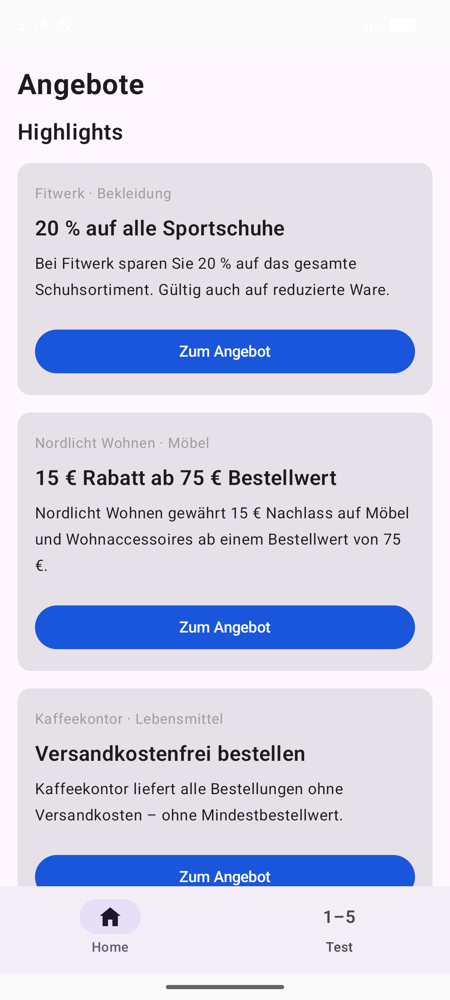
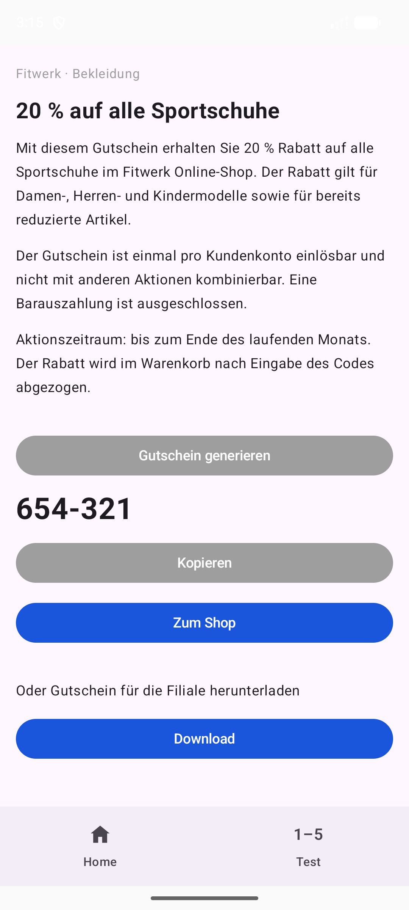

# Overview

Tracking concept for the **Angebote** Android test app (application ID
`de.angebote.trackingtest`). Analytics SDK: **Firebase / Google Analytics
for Firebase**.

Single source of truth for tracking. Every value the tracking uses is
defined once in [Attachment 1](#attachment-1--app-description); the
sections point to it and do not copy it. This is a little less convenient
to read, but a value can never drift out of sync with a copy.

Open questions and things not built yet are in
[Attachment 2](#attachment-2--open-questions-and-ideas).

Each event section has four parts — **Why**, **Code**, **Values**,
**Trigger** — and a **Status** line (*done* / *in progress* / *not done*)
under the heading. The trigger is written as a moment in the app, not as a
method name; the developer picks the technical hook. The text stays in the
imperative even where the status is *done* — the concept is not rewritten
after the code exists.

## Version history

**1.0 — 2026-09-01.** Initial version. It covers:

- the overview and the rules this document follows;
- the Analytics SDK setup: Firebase project, Gradle, initialisation in
  code, and the check that events arrive;
- the `app_open` event;
- screen tracking with `screen_view`;
- the e-commerce chain `view_item_list` -> `select_item` -> `view_item` ->
  `begin_checkout`, and the four custom events of the offer screen;
- Attachment 1 — the app description and the tracking values;
- Attachment 2 — open questions and ideas.

The version number belongs to this document, not to the app. A new
version is added on top of this list when a section is added, removed, or
changed in a way that changes what the developer has to build.

---

# 1. Analytics SDK setup

Status: **done.**

Source: [Firebase — Get started with Google Analytics on Android](https://firebase.google.com/docs/analytics/android/get-started).

## Firebase project and app registration

1. Create the Firebase project (here: `angebote-app-tracking-test`).
2. Keep **Enable Google Analytics** switched on in the wizard. It creates
   the linked GA4 property. The Firebase console and the GA4 interface are
   two views on the same data.
3. Register the Android app with the package name
   `de.angebote.trackingtest` — it must be the same as `applicationId` in
   `app/build.gradle.kts`.
4. Download `google-services.json` and put it into
   `android/app/google-services.json`.

The file `google-services.json` is not a secret: the same file is shipped
inside the APK. It is kept in the repository so the project builds out of
the box.

## Gradle

`android/gradle/libs.versions.toml`:

```toml
[versions]
googleServices = "4.5.0"
firebaseBom = "34.18.0"

[libraries]
firebase-bom = { group = "com.google.firebase", name = "firebase-bom", version.ref = "firebaseBom" }
firebase-analytics = { group = "com.google.firebase", name = "firebase-analytics" }

[plugins]
google-services = { id = "com.google.gms.google-services", version.ref = "googleServices" }
```

`android/build.gradle.kts` (project level):

```kotlin
plugins {
    alias(libs.plugins.google.services) apply false
}
```

`android/app/build.gradle.kts` (module level):

```kotlin
plugins {
    alias(libs.plugins.google.services)
}

dependencies {
    // The BoM keeps all Firebase libraries at compatible versions.
    implementation(platform(libs.firebase.bom))
    implementation(libs.firebase.analytics)
}
```

Then **Sync Project with Gradle Files** in Android Studio.

## Initialise Analytics in code

The SDK starts itself through a manifest entry that comes with the
library, so automatic events (`first_open`, `session_start`,
`user_engagement`, …) are collected without any Kotlin code. To send our
own events, use the singleton:

```kotlin
import com.google.firebase.Firebase
import com.google.firebase.analytics.FirebaseAnalytics
import com.google.firebase.analytics.analytics
import com.google.firebase.analytics.logEvent

Firebase.analytics.logEvent(...)
```

The Firebase guide keeps the instance in a field of the Activity
(`private lateinit var firebaseAnalytics`). This app does not: the screens
are composables, not Activities, so the events are sent from
`Analytics.kt` and `Firebase.analytics` is read there. It returns the same
single instance.

## DA — check that events arrive

This part is for the digital analyst (DA), not for the developer.

DebugView shows events from one device in near real time, without the
normal batching delay. Standard reports in Firebase and GA4 are delayed
by several hours up to a day.

```
adb shell setprop debug.firebase.analytics.app de.angebote.trackingtest
adb shell am force-stop de.angebote.trackingtest
```

The flag is read at the next app start, so the app has to be stopped
once. Then start the app and open **Firebase Console → Analytics →
DebugView** and pick the device at the top.

Switch the debug mode off again with:

```
adb shell setprop debug.firebase.analytics.app .none.
```

An emulator needs a **system image with Google Play**. Without Google
Play services the SDK cannot send events.

---

# 2. app_open event

Status: **done.**

## Why

`app_open` is a recommended Firebase event. Firebase does not collect it
automatically, so the app sends it. It is the **first event** every time
the app comes to the foreground, before the `screen_view` of the screen
that becomes visible — it marks the start of a visit.

## Code

```kotlin
Firebase.analytics.logEvent(FirebaseAnalytics.Event.APP_OPEN) { }
```

## Values

None for now. Parameters worth testing later are in
[Attachment 2](#attachment-2--open-questions-and-ideas).

## Trigger

Send `app_open` when the whole app comes to the foreground:

- the first launch,
- every return from the background,
- every return from the browser click-out or the PDF download.

Do **not** send it on things that are not a real foregrounding — a screen
rotation, a system dialog on top of the app, or moving between screens
inside the app. It must come out **before** the first `screen_view` of
that moment.

---

# 3. Screen tracking — `screen_view`

Status: **done.**

## Why

We want to know which screens are opened more often and which less. That
feeds screen-performance and conversion work. Screen tracking is what
measures it.

## Turn automatic screen tracking off

Firebase sends its own `screen_view` from the Activity lifecycle. This app
draws all 5 screens inside one Activity, so the automatic event would
always report the same screen and fire next to our own — duplicate,
useless data.

Switch it off in `android/app/src/main/AndroidManifest.xml`, inside
`<application>`:

```xml
<meta-data
    android:name="google_analytics_automatic_screen_reporting_enabled"
    android:value="false" />
```

This turns off only the automatic `screen_view`. All other automatic
events and all manual events keep working.

## Code

```kotlin
firebaseAnalytics.logEvent(FirebaseAnalytics.Event.SCREEN_VIEW) {
    param(FirebaseAnalytics.Param.SCREEN_NAME, screenName)
    param("current_offer", currentOffer)
}
```

`SCREEN_CLASS` is not sent. Its value would describe the technical build
of the screen, not user behaviour, and with all screens in one Activity it
would say almost nothing. A developer may add it; the analysis does not
need it.

## Values

| Parameter | Constant | Where the value comes from |
|---|---|---|
| Screen name | `Param.SCREEN_NAME` | Attachment 1 → *Tracking values*, column `screen_name` |
| Current offer | `current_offer` (custom) | Attachment 1 → *Tracking values*, column `current_offer` |

## Trigger

Send `screen_view` every time a screen becomes visible to the user:

- when the app opens the start screen or an offer screen,
- on every **return** to a screen — back from an offer to the start
  screen, and back into the app from the browser, from the PDF download,
  or from another app.

A short return counts too. Some of these returns are not really a new view
(back from the browser or the download, or an app switch); marking them so
they can be excluded from mass metrics is an open point — see
[Attachment 2](#attachment-2--open-questions-and-ideas).

---

# 4. E-commerce events

Status: **done.**

## Why

Lists of offers are measured in Google Analytics as e-commerce events.
The whole way through such a list is one chain: the list is shown, one
offer is picked out of it, the offer screen opens, and the user does the
target action there. For the chain to be readable, the same values have
to travel through all of its steps.

`view_item_list` → `select_item` → `view_item` → `begin_checkout`

`begin_checkout` is the **target action**. It is sent when the user taps
**"Zum Shop"** or **"Download"** on the offer screen. Both taps mean the
same for the analysis — the user leaves with the offer — so both send the
same event with the full item.

Next to this chain there are **four custom events**, one per button on the
offer screen: `generate_code`, `copy_code`, `go_to_shop`,
`download_coupon`. They carry **no e-commerce parameters**; the offer they
belong to can only be read from the `screen_name` that Firebase attaches
to every event.

One screen can carry several lists. Here we look at one list only:
**Highlights** on the start screen, with the four offer cards.

## Why `begin_checkout` marks the target action

`begin_checkout` is a reserved GA4 e-commerce event, so it takes the
`items` array. The offer, brand, coupon, list and position travel to the
target click and can be read in the standard e-commerce reports with no
custom fields.

A custom event cannot carry `items` — Firebase drops array parameters on
non-e-commerce events (`firebase_error 21`). So `go_to_shop` and
`download_coupon` alone would leave the target click with no offer data in
the e-commerce reports.

The name is not literal: the app has no checkout and no cart. The
e-commerce checkout funnel is reused to measure a coupon funnel.
**This has to be agreed inside the company before it goes live.** The gain
is the ready-made funnel and item reporting; the cost is that "checkout"
in the reports means "left for the shop, or downloaded the coupon".

## Values

| Firebase constant | Where the value comes from | gtag.js parameter (for the analyst) |
|---|---|---|
| `Param.ITEM_LIST_ID` | fixed: `home_highlights` | `item_list_id` |
| `Param.ITEM_LIST_NAME` | fixed: `Highlights` | `item_list_name` |
| `Param.ITEM_ID` | Attachment 1 → *Tracking values*, column `app offer id` | `item_id` |
| `Param.ITEM_NAME` | Attachment 1 → *Tracking values*, column `Offer from` | `item_name` |
| `Param.ITEM_BRAND` | same value as `item_name` | `item_brand` |
| `Param.COUPON` | Attachment 1 → *Tracking values*, column `current_offer` | `coupon` |
| `Param.INDEX` | Attachment 1 → *Tracking values*, column `index` | `index` |
| `code_copied` | custom, only in `go_to_shop` — see below | `code_copied` |

Types: `index` is a number (`putLong`), everything else in the item is a
string.

## Code

**The code blocks below are filled with the values of one offer as an
example: `offer_01`, Fitwerk, index `0`.** Every event always carries the
offer it is really about. A tap on the third card sends `offer_03`,
`Kaffeekontor`, `Versandkostenfrei bestellen`, `index` `2` — and the
`view_item` and `begin_checkout` of that offer carry the same values.

Where `item_list_id` and `item_list_name` go:

- `view_item_list`, `select_item`: at event level, outside the items.
- `view_item`, `begin_checkout`: inside the item — these events cannot
  carry them at event level.

A developer may instead always put them inside the items, for every event.
Then the two values repeat with each item instead of being written once at
event level. Pick whichever is simpler to implement.

### `view_item_list`

Trigger: when the user sees the list — in practice, together with the
start-screen `screen_view`. It carries all four offers.

```kotlin
val item01 = Bundle().apply {
    putString(FirebaseAnalytics.Param.ITEM_ID, "offer_01")
    putString(FirebaseAnalytics.Param.ITEM_NAME, "Fitwerk")
    putString(FirebaseAnalytics.Param.ITEM_BRAND, "Fitwerk")
    putString(FirebaseAnalytics.Param.COUPON, "20 % auf alle Sportschuhe")
    putLong(FirebaseAnalytics.Param.INDEX, 0)
}
// the same for offer_02 (index 1), offer_03 (index 2), offer_04 (index 3)

Firebase.analytics.logEvent(FirebaseAnalytics.Event.VIEW_ITEM_LIST) {
    param(FirebaseAnalytics.Param.ITEM_LIST_ID, "home_highlights")
    param(FirebaseAnalytics.Param.ITEM_LIST_NAME, "Highlights")
    param(
        FirebaseAnalytics.Param.ITEMS,
        arrayOf(item01, item02, item03, item04),
    )
}
```

The event says the list was on the screen. It does not say that the user
saw all four cards — see
[Attachment 2](#attachment-2--open-questions-and-ideas).

### `select_item`

Trigger: the user taps **"Zum Angebot"**. Carries the offer that was
tapped.

```kotlin
val item = Bundle().apply {
    putString(FirebaseAnalytics.Param.ITEM_ID, "offer_01")
    putString(FirebaseAnalytics.Param.ITEM_NAME, "Fitwerk")
    putString(FirebaseAnalytics.Param.ITEM_BRAND, "Fitwerk")
    putString(FirebaseAnalytics.Param.COUPON, "20 % auf alle Sportschuhe")
    putLong(FirebaseAnalytics.Param.INDEX, 0)
}

Firebase.analytics.logEvent(FirebaseAnalytics.Event.SELECT_ITEM) {
    param(FirebaseAnalytics.Param.ITEM_LIST_ID, "home_highlights")
    param(FirebaseAnalytics.Param.ITEM_LIST_NAME, "Highlights")
    param(FirebaseAnalytics.Param.ITEMS, arrayOf(item))
}
```

### `view_item`

Trigger: a tap on an offer in the list opened the offer screen.
`view_item` follows the `screen_view` of that screen and **belongs to that
one opening**.

Nothing else sends it. A return from the browser, a switch to another app
and back, or a system dialog on top — each of those sends `screen_view`
again, `view_item` not.

A second tap on the same offer in the list is a new opening, not a return:
it sends `select_item`, `screen_view` and `view_item` again.

The item is the same one that was sent in `select_item` (`item_id`,
`item_name`, `item_brand`, `coupon`, `index`), plus `item_list_id` /
`item_list_name` inside the item.

```kotlin
val item = Bundle().apply {
    putString(FirebaseAnalytics.Param.ITEM_LIST_ID, "home_highlights")
    putString(FirebaseAnalytics.Param.ITEM_LIST_NAME, "Highlights")
    putString(FirebaseAnalytics.Param.ITEM_ID, "offer_01")
    putString(FirebaseAnalytics.Param.ITEM_NAME, "Fitwerk")
    putString(FirebaseAnalytics.Param.ITEM_BRAND, "Fitwerk")
    putString(FirebaseAnalytics.Param.COUPON, "20 % auf alle Sportschuhe")
    putLong(FirebaseAnalytics.Param.INDEX, 0)
}

Firebase.analytics.logEvent(FirebaseAnalytics.Event.VIEW_ITEM) {
    param(FirebaseAnalytics.Param.ITEMS, arrayOf(item))
}
```

### `begin_checkout`

Trigger: the user taps **"Zum Shop"** or **"Download"**, on the tap and
before the side effect (browser, PDF) — not on its result. Opening the
browser or saving the PDF can fail for technical reasons; that is not user
behaviour. The item is the same one as in `view_item` above.

```kotlin
Firebase.analytics.logEvent(FirebaseAnalytics.Event.BEGIN_CHECKOUT) {
    param(FirebaseAnalytics.Param.ITEMS, arrayOf(item))
}
```

`begin_checkout` does not say which of the two buttons was tapped, and it
carries no other parameter. It only says that a target action happened on
this offer. The split between the two buttons is done with the custom
events below.

### The four custom events

Trigger: the user taps the button — on the tap, before the side effect,
same timing as `begin_checkout`.

| Event | Button | Parameter |
|---|---|---|
| `generate_code` | "Gutschein generieren" | none |
| `copy_code` | "Kopieren" | none |
| `go_to_shop` | "Zum Shop" | `code_copied` (see below) |
| `download_coupon` | "Download" | none |

```kotlin
Firebase.analytics.logEvent("generate_code") { }
Firebase.analytics.logEvent("copy_code") { }
Firebase.analytics.logEvent("download_coupon") { }

Firebase.analytics.logEvent("go_to_shop") {
    param("code_copied", "yes")
}
```

On the **"Zum Shop"** tap, `go_to_shop` and `begin_checkout` are both
sent. On the **"Download"** tap, `download_coupon` and `begin_checkout`
are both sent.

**`code_copied`** — a custom parameter of `go_to_shop`, event scope. It
answers one question: did the user take the code with them into the shop?

It starts at `no` **every time the offer screen is opened**, and turns to
`yes` if **"Kopieren"** was tapped on that visit of the offer screen
before the click-out — the same per-visit state as the button colour
(Attachment 1 → *Behaviour*).

`yes` / `no` and not `true` / `false` on purpose — Firebase has no boolean
parameter type, the value is a string in any case, and `true` / `false`
would be read as a boolean that GA4 does not have.

## DA — registration in GA4

This part is for the digital analyst (DA), not for the developer.

Status: **done.**

Register a custom parameter with **event** scope, named `code_copied`.

The item parameters and the Screen name dimension are built in and need no
registration.

---

# Attachment 1 — App description

Describes the app itself and holds every value the tracking uses. The
sections above point here and do not repeat the values.

## Purpose

**Angebote** is a prototype. The goal is the smallest app on which mobile
tracking can be set up and measured. This is the first version of the app
and the first version of its tracking in GA4 (Android, Firebase).

The app is not a product. It is not published on Google Play, but it is
built as a normal, installable app. The user interface is in German, the
documentation is in English. The shops and offers are invented and do not
refer to real companies.

## Screens

Two screen types, 5 screens in total: one start screen and one offer
screen per offer (four offers).





**Start screen.** Four offers one under another, fixed order, no sorting
and no filtering. Each offer is a card: shop, title, teaser, and a
**"Zum Angebot"** button that opens the offer screen.

**Offer screen.** A **"Zur Startseite"** button at the top (the system
back button works too). Below it, top to bottom:

| Element | Behaviour |
|---|---|
| Offer text | 2–3 paragraphs with the terms. Static. |
| Button **"Gutschein generieren"** | Shows the code `654-321` and a "Kopieren" button below it. |
| Button **"Kopieren"** | Copies the code to the clipboard, shows a short message. |
| Button **"Zum Shop"** | Click-out. Opens `https://www.google.de` in the external browser. |
| Text **"Oder Gutschein für die Filiale herunterladen"** | Static. |
| Button **"Download"** | Builds a PDF coupon and saves it to the Downloads folder (see *Coupon PDF*). |

All three actions — code, click-out, download — are available on the offer
screen at the same time. There are no different offer types. The code
`654-321` is the same for every offer.

## Behaviour

**A tapped button changes colour:** blue → grey. The colour resets to blue
when the offer screen is opened again.

**Navigation** only goes forward through "Zum Angebot" and back to the
start screen.

**The app has no:** login, search, search history, Merkzettel, map,
profile, settings, category list, cart.

## Tracking values

The values are hard-coded in the app (there is no server). Everything that
goes into an event comes from this table.

| Screen (`screen_name`) | Type | Offer from (shop) | `current_offer` | app offer id | index |
|---|---|---|---|---|---|
| `Startseite` | start | — | `Neustarter & Highlights` | — | — |
| `Fitwerk` | offer | Fitwerk | `20 % auf alle Sportschuhe` | `offer_01` | 0 |
| `Nordlicht Wohnen` | offer | Nordlicht Wohnen | `15 € Rabatt ab 75 € Bestellwert` | `offer_02` | 1 |
| `Kaffeekontor` | offer | Kaffeekontor | `Versandkostenfrei bestellen` | `offer_03` | 2 |
| `Sichtbar Optik` | offer | Sichtbar Optik | `2 für 1 auf Brillengläser` | `offer_04` | 3 |

- On an offer screen `screen_name` is the same as the shop name (in
  *E-commerce events* the same value goes into `item_name` and
  `item_brand`).
- `current_offer` on an offer screen is its title (in *E-commerce events*
  — `coupon`).
- `index` is the position of the card on the start screen, first is `0`.
- `screen_class` is not sent (see *Screen tracking*).
- The offer list is fixed: `item_list_id` = `home_highlights`,
  `item_list_name` = `Highlights`.

## Coupon PDF

The **"Download"** button builds a one-page PDF inside the app: shop,
offer title, the code in large type, and a line asking the user to print
it and show it in the shop.

The file is saved to the public Downloads folder as
`gutschein-<offer-id>.pdf`, for example `gutschein-offer_01.pdf`. It can
be opened, printed or shared like any other file in Downloads.

## Technical decisions

| Item | Value |
|---|---|
| App name on the phone | Angebote |
| Application ID | `de.angebote.trackingtest` |
| Language and UI | Kotlin, Jetpack Compose |
| Lowest Android | 10 (API 29) |
| Built against | API 37 |
| Analytics SDK | Firebase / Google Analytics for Firebase |

**Why Android 10 as the lowest version.** Writing a file into the public
Downloads folder in a clean way needs API 29. Phones older than Android 10
are rare in Europe, so this is not a real limit for a test app.

**Why the SDK came later.** The app was first built without any analytics.
The point of the app is to measure what it costs to add tracking to code
that is already done. If the SDK had gone in with the first build, that
cost could not be seen.

## Status

The app was built, installed and checked by hand on a real Pixel 10a
(Android 17) and on several emulators, including a tablet.

Checked by hand: start screen, offer screen, code generation, the colour
change of used buttons, the PDF download into Downloads, and the click-out
into the browser.

---

# Attachment 2 — Open questions and ideas

Things not built yet: parameters worth testing, forward-looking ideas, and
known gaps. Nothing here is implemented — a working list, not a spec.

## app_open parameters

`app_open` is sent without parameters. Google does not fix a parameter set
for it, so it is worth testing what can be attached at all.

Candidates:

| Parameter | Meaning | Why |
|---|---|---|
| `background_duration_sec` | how long the app was in the background before this foregrounding | input for analysing return behaviour |
| `trigger_source` | `notification` / `manual_switch` / … | how the user got back into the app |
| `previous_screen` | which screen was active before the app went to the background | context for the return |

## `screen_view` on a return to the foreground

When the user comes back to a screen from the browser click-out, the PDF
download, or an app switch, that screen is in focus again and
`screen_view` fires once more. It is not really a view — it is a return.

Recommendation: **keep sending it.** After a long time in the background
GA4 starts a new session, and without a `screen_view` that session has no
entry screen; it also keeps the numbers comparable with `app_open` and
with Firebase's own automatic screen tracking. The distortion of screen
counts is handled by marking, not by dropping the event.

Two things to work out:

1. **Mark it.** The return `screen_view` should carry an extra parameter
   so it can be excluded from mass metrics (screen counts, screen depth),
   where it would otherwise inflate the numbers.
2. **Use it.** The same point is useful further on: after the return, does
   the user go on through the app or close it? A good place to measure
   post-return behaviour.

The parameter name, its values, and how to tell that a `screen_view` is a
return are open.

## Rotation resets the app to the start screen

Found on 2026-09-01 while testing the `view_item` trigger, reproduced on an
emulator: with an offer screen open, turning the device brings the app back
to the start screen. The open offer is lost.

The cause is not in the tracking. Android destroys the screen on a rotation
and builds it again, and the app holds "which offer is open" in memory that
is cleared at that moment. It starts from an empty state, and that state is
the list.

What it does to the numbers: after a rotation on an offer screen the app
sends `screen_view` with `Startseite` and a `view_item_list`, as if the
user had walked back to the list. The visit to the offer looks shorter than
it was, and the list collects a view nobody asked for.

The fix is small: the open offer has to be kept in the storage that
survives the rebuild. It is not done yet. When it is done, it has to be
done together with the `view_item` trigger — once the offer screen survives
a rotation, the screen is built again and would send a second `view_item`
for the same opening, unless the fact "already sent" is kept in the same
storage.

## `view_item_list` over the whole list

`view_item_list` is sent with all four offers at once. The event says the
list was on the screen, not that the user saw every card. A later version
could refine this: send only the positions that were really seen.

## Linking the custom events to an offer

The custom events (`generate_code`, `copy_code`, `go_to_shop`,
`download_coupon`) carry no offer data — the offer is recovered only from
`screen_name`. Open question: is that enough for the reports, or do these
events need an explicit offer parameter.
